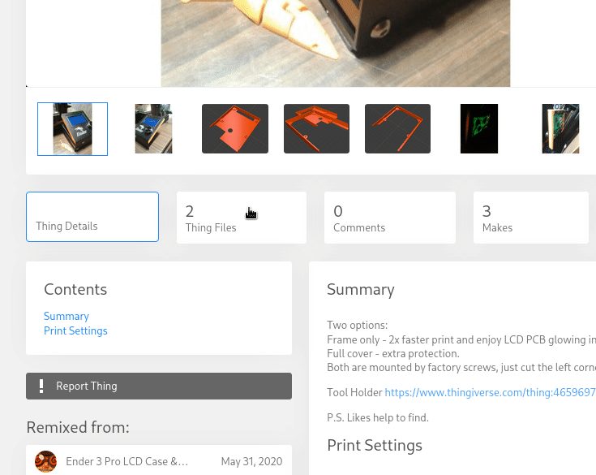

# Thingiview
Model viewer for Thingiverse
## Quick start
1. Install a userscript manager:
   - Tampermonkey (popular):
     - [For Chrome](https://chrome.google.com/webstore/detail/tampermonkey/dhdgffkkebhmkfjojejmpbldmpobfkfo)
     - [For Firefox](https://addons.mozilla.org/en-US/firefox/addon/tampermonkey/)
   - Violentmonkey (recommended):
     - [For Chrome](https://chrome.google.com/webstore/detail/violentmonkey/jinjaccalgkegednnccohejagnlnfdag)
     - [For Firefox](https://addons.mozilla.org/en-US/firefox/addon/violentmonkey/)
   - Greasemonkey:
     - [For Firefox](https://addons.mozilla.org/en-US/firefox/addon/greasemonkey/)
2. Click here: [thingiview.user.js](https://github.com/czkz/thingiview/raw/master/thingiview.user.js), press "Confirm installation".
3. Go to Thingiverse, click on a file's thumbnail to open/close the preview.

