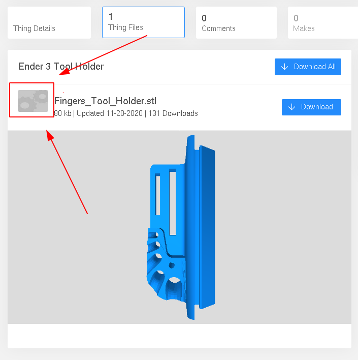

# Thingiview
Model viewer for Thingiverse
## Quick start
1. Install Violentmonkey extension (Tampermonkey/Greasemonkey will work too).
   - [Violentmonkey for Chrome](https://chrome.google.com/webstore/detail/violentmonkey/jinjaccalgkegednnccohejagnlnfdag)
   - [Violentmonkey for Firefox](https://addons.mozilla.org/en-US/firefox/addon/violentmonkey/)
2. Open [thingiview.user.js](https://github.com/czkz/thingiview/raw/master/thingiview.user.js) in a browser, press "Confirm installation".
3. Go to Thingiverse, click on a file's thumbnail to open/close the preview.

